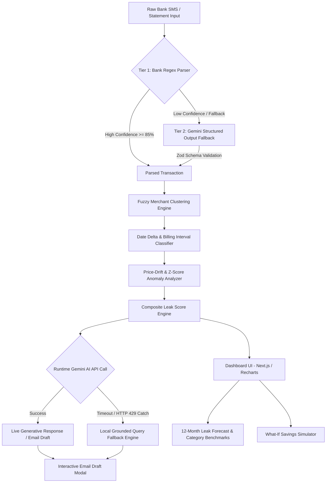
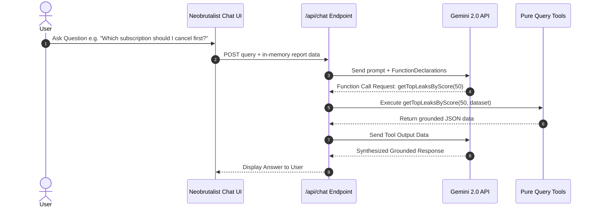
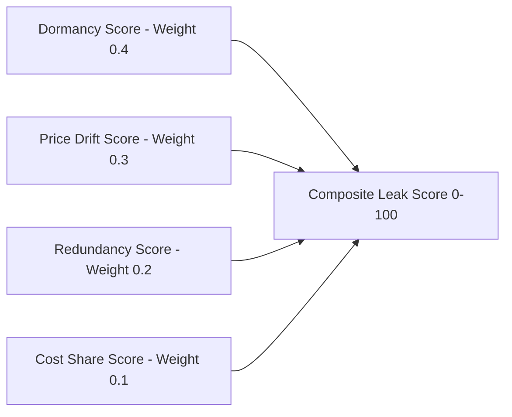
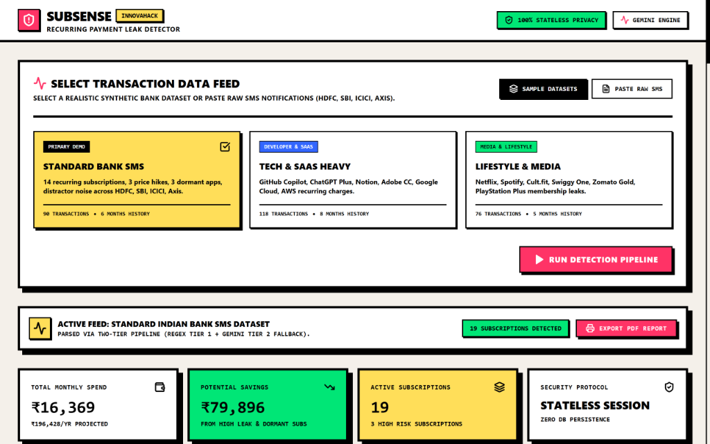
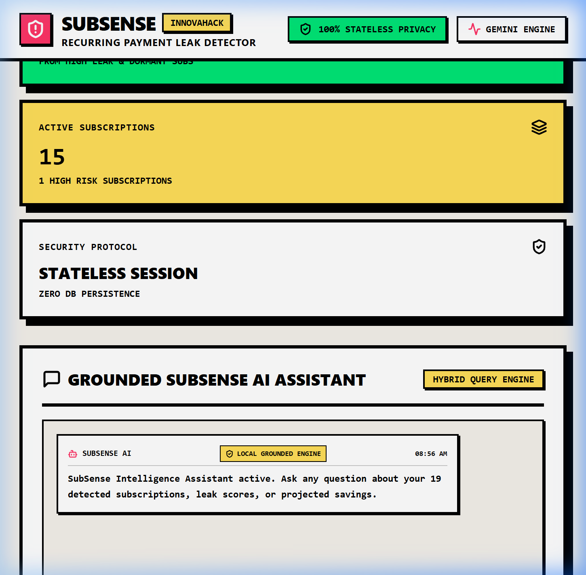
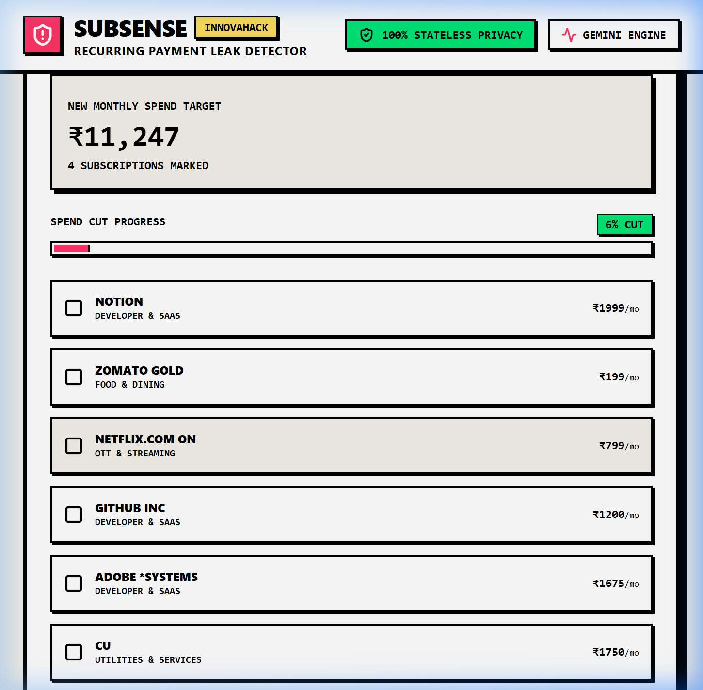
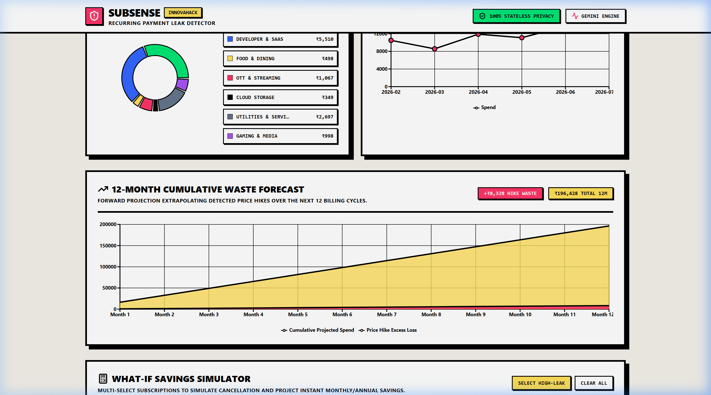
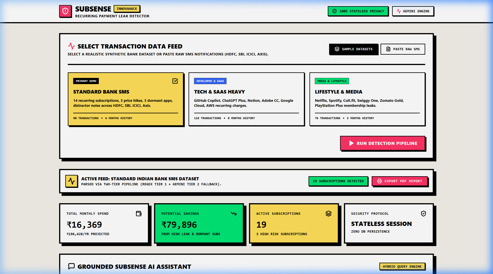

# ⚡ SubSense - Hidden Subscription & Recurring Payment Leak Detector


🚀 **Live Demo**: [https://subsense-nine.vercel.app/](https://subsense-nine.vercel.app/)

---

## 📋 Submission & Team Metadata

- **Hackathon**: InnovaHack Chapter-1  
- **Track / Domain**: FinTech (Problem Statement 1)  
- **Team Name**: Larpers  
- **Team Leader**: Pranav Kishan T Y  
- **Team Members**:
  - **Pranav Kishan T Y** (Team Leader)
  - **Narain B K**
  - **Anurup R Krishnan**

---

## ⚡ 60-Second Quick Tour for Judges

If you are evaluating SubSense under a tight time limit, follow this 5-step quick tour:

1. **Select Dataset**: Click the **`TECH & SAAS HEAVY`** card on the feed selector and click **`RUN DETECTION PIPELINE`**.
2. **Ask AI Assistant**: In the Grounded AI Assistant box, click the suggestion or type *"Which subscription should I cancel first?"*.
3. **Inspect Price Hike**: Scroll down to the subscription list, expand the **`Netflix`** card, and view the price drift history (`+23.1% hike`), formula score breakdown, and category market benchmark.
4. **Test What-If Savings**: Check the boxes next to 2 high-leak subscriptions in the What-If Savings Simulator to calculate live projected monthly and annual savings.
5. **Export PDF Executive Report**: Click the **`EXPORT PDF REPORT`** button in the top action banner for an instant, clean 1-page PDF summary.

---

## 📌 Problem Statement & Real-World Pain Point

Millions of users in India and globally quietly lose thousands of rupees every month to recurring payment leaks. Subscriptions quietly auto-renew, services unannouncedly raise prices by 15-30%, unused/dormant memberships continue charging credit cards, and users subscribe to redundant services across identical categories (e.g. 3 streaming OTT apps or multiple AI tools).

Existing budget trackers fail because:
1. They require manual CSV categorization or paid bank scraping APIs.
2. They rely on simple merchant grouping (`upload CSV -> group by merchant -> show a table`), failing to distinguish one-off transactions from recurring interval billing.
3. They offer no actionable path to actually stop the leak beyond showing a number.

**SubSense** solves this by accepting raw bank SMS notifications or statements, parsing them through a two-tier extraction pipeline, running fuzzy merchant normalization & delta interval analysis, computing a transparent composite **Leak Score**, and dynamically drafting personalized cancellation/downgrade emails via Gemini AI.

---

## 🔥 Key Features

- **Synthetic Data Generator & Bundled Datasets**: Ships with a seedable TS generator simulating HDFC, SBI, ICICI, and Axis SMS notifications, planted with price hikes, dormant subscriptions, and distractor noise.
- **Two-Tier Extraction Pipeline**:
  - **Tier 1**: Deterministic Regex templates for Indian bank formats (`HDFC`, `SBI`, `ICICI`, `AXIS`).
  - **Tier 2**: `@google/genai` structured JSON fallback validated strictly with `Zod` schemas.
- **Fuzzy Merchant Normalization & Interval Detection**: Clusters merchant variants (e.g., `NETFLIX.COM`, `NETFLIX*ENTERTAINMENT`, `NETFLIX INDIA`) using Levenshtein distance & token overlap, computing charge interval consistency (weekly/monthly/quarterly/annual).
- **Price-Drift & Anomaly Engine**: Calculates standard deviation & Z-score across charge history to distinguish sustained step-change price hikes (`+25%`) from one-off spikes.
- **Composite Leak Score Formula**: Evaluates 4 weighted factors (Dormancy 40%, Price Drift 30%, Redundancy 20%, Cost Share 10%) with transparent UI breakdowns.
- **Grounded Gemini Chat Assistant (Tool Calling)**: Live interactive assistant where users can ask natural language questions about their own computed leak report, powered by Gemini function calling tools (`getSubscriptionByName`, `getTopLeaksByScore`, `computeSavingsIfCancelled`, `getCategorySpendBreakdown`).
- **12-Month Cumulative Waste Forecast**: Forward extrapolation engine projecting price-drift trends forward over the next 12 billing cycles, rendered in a high-contrast Recharts AreaChart.
- **Category Price Benchmarking**: Compares detected subscriptions against typical Indian market category averages (`OTT`, `Food`, `SaaS`, `Fitness`, `Cloud`), flagging whether spend sits above, at, or below market baselines.
- **Exportable PDF Executive Report**: Instant 1-click client-side export generating a formatted executive PDF report summary for offline sharing or printing.

---

## 🛡️ Hardening, Reliability & Fault-Tolerant Architecture

SubSense was engineered with demo-safety and enterprise fault-tolerance at its core:

- **8-Second API Timeout (`Promise.race`)**: All external Gemini API requests are bounded by strict 8-second timeouts to prevent UI freezing if cloud AI networks experience latency or packet loss.
- **Seamless Fallback Execution**: If an API key is missing, times out, or hits a rate limit (HTTP 429), SubSense automatically degrades to local grounded query engines and offline email synthesizers without throwing unhandled exceptions.
- **React ErrorBoundary**: The entire Dashboard is wrapped in a custom `<ErrorBoundary />` component, trapping rendering anomalies gracefully.
- **Stateless Session Privacy**: Zero persistent database storage; all financial data remains in-memory during the active browser session.

---

## 🧪 Comprehensive Test Suite (33 Tests, 100% Passing)

SubSense includes an automated unit test suite executed via Vitest covering core math, edge-case parsing, tool calls, and extrapolation logic:

- **`engine.test.ts` (22 Tests)**: Validates bank Regex parsing (HDFC, SBI, ICICI, Axis, Rs. comma formatting), fuzzy merchant clustering, sub-brand isolation (`Amazon Prime` vs `Amazon Pay`), interval delta classification, price drift step-hike vs spike categorization, and leak score clamping (0-100).
- **`chat.test.ts` (6 Tests)**: Validates pure query tool functions (`getSubscriptionByName`, `getTopLeaksByScore`, `computeSavingsIfCancelled`, `getCategorySpendBreakdown`).
- **`forecast.test.ts` (2 Tests)**: Validates 12-month forward extrapolation math and cumulative price-hike waste calculations.
- **`benchmarks.test.ts` (3 Tests)**: Validates category market pricing percentage difference and status categorization.

**Performance Benchmark**: Parses, clusters, analyzes, and scores a 60-transaction batch in **< 1000ms**.

Run tests locally:
```bash
npm test
```

---

## 🏗️ System Architecture & Tool-Calling Flow



### Grounded Gemini Chat Assistant Tool-Calling Flow



---

## 🧮 Composite Leak Score Composition



### Formula
$$\text{LeakScore} = 0.4 \times \text{DormancyScore} + 0.3 \times \text{PriceDriftScore} + 0.2 \times \text{RedundancyScore} + 0.1 \times \text{CostShareScore}$$

- **DormancyScore (40%)**: 100 if subscription is flagged as dormant/unused; 0 if active.
- **PriceDriftScore (30%)**: 100 if sustained price hike detected with > 20% increase; 60 for spikes; 0 for stable.
- **RedundancyScore (20%)**: 100 if >= 3 active subscriptions exist in the same category; 60 for 2; 0 if unique.
- **CostShareScore (10%)**: Monthly spend ratio relative to total recurring subscription outlay (0-100).

---

## 🛠️ Tech Stack Table

| Component | Technology / Library | Description |
| :--- | :--- | :--- |
| **Framework** | Next.js 14 (App Router) | React server/client framework |
| **Language** | TypeScript | Strict type safety across domain models |
| **Styling** | Tailwind CSS | High-contrast Neobrutalist design system |
| **AI LLM** | Google Gemini API (`@google/genai`) | Tier 2 extraction, tool calling & email generation |
| **Validation** | Zod | Strict schema validation of LLM outputs |
| **Fuzzy Matching** | `fastest-levenshtein` | Merchant string normalization & clustering |
| **Interval Math** | `date-fns` | Date delta & billing frequency calculation |
| **Data Viz** | Recharts | Donut breakdown & 12-month area forecast charts |
| **PDF Export** | Browser Print API + `@media print` CSS | 1-click vector PDF executive report via native print dialog |
| **Testing** | Vitest | Automated unit test suite (33 passing tests) |

---

## 🚀 Quick Start & Setup Instructions

### Prerequisites
- Node.js `v18.0.0` or higher
- Free Google Gemini API Key from [Google AI Studio](https://aistudio.google.com/)

### 1. Clone & Install
```bash
git clone https://github.com/Destroyer795/subsense.git
cd subsense
npm install
```

### 2. Configure Environment Variables
Copy `.env.example` to `.env`:
```bash
cp .env.example .env
```
Fill in your Gemini API key in `.env`:
```env
GEMINI_API_KEY=your_gemini_api_key_here
GEMINI_MODEL=gemini-2.5-flash
```

### 3. Run Development Server
```bash
npm run dev
```
Open [http://localhost:3000](http://localhost:3000) in your browser.

### 4. Run Automated Unit Tests
```bash
npm test
```

---

## 📊 Regenerating Synthetic Datasets

To regenerate the bundled sample JSON datasets in `/data/samples/`:
```bash
npm run generate-data
```
Outputs:
- `data/samples/sample-standard.json` (90 txns)
- `data/samples/sample-tech-heavy-saas.json` (118 txns)
- `data/samples/sample-lifestyle-ott.json` (76 txns)

---

## 🌐 Deploying to Vercel

SubSense is stateless and ready for instant 1-click deployment to Vercel:

1. Push your repository to GitHub (`git push origin main`).
2. Import the project into [Vercel](https://vercel.com).
3. Add Environment Variables in Vercel settings:
   - `GEMINI_API_KEY`: Your Google AI Studio API key
   - `GEMINI_MODEL`: `gemini-2.5-flash`
4. Click **Deploy**.

---

## 📸 Product Screenshots & Visual Evidence

| 1. Dashboard & Feed Selector | 2. Grounded Gemini AI Assistant |
| :---: | :---: |
|  |  |

| 3. Subscriptions & Price Hike Analysis | 4. 12-Month Waste Forecast |
| :---: | :---: |
|  |  |

| 5. 1-Click Executive PDF Report Export |
| :---: |
|  |

---

## 🔒 Known Limitations & Scope Transparency

- **Synthetic SMS Inputs**: The built-in generator creates synthetic Indian bank SMS formats (HDFC, SBI, ICICI, Axis). Real-world SMS logs may contain carrier-specific noise.
- **Category Benchmarks**: Category benchmark figures in `src/data/category-benchmarks.ts` consist of illustrative reference market baselines for hackathon demonstration purposes.
- **Dormancy Inputs**: Dormancy status is user-confirmed via a toggle in the UI or flagged via planted metadata, ensuring full transparency without invasive behavioral telemetry.
- **In-Memory Storage**: Financial data is never stored in a database, ensuring 100% privacy per session.

---

## 📜 License

This project is licensed under the MIT License - see the [LICENSE](LICENSE) file for details.
