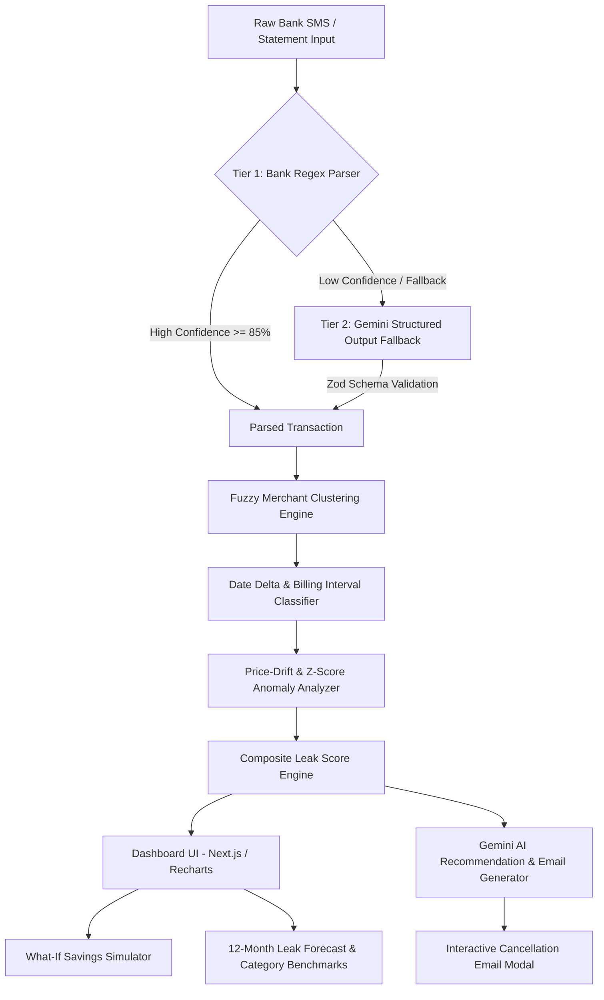
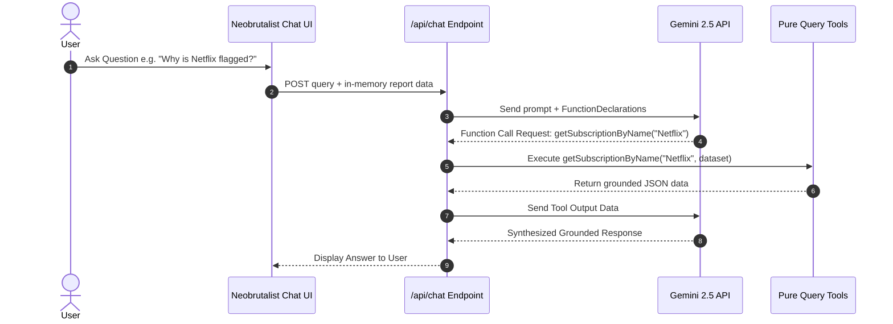
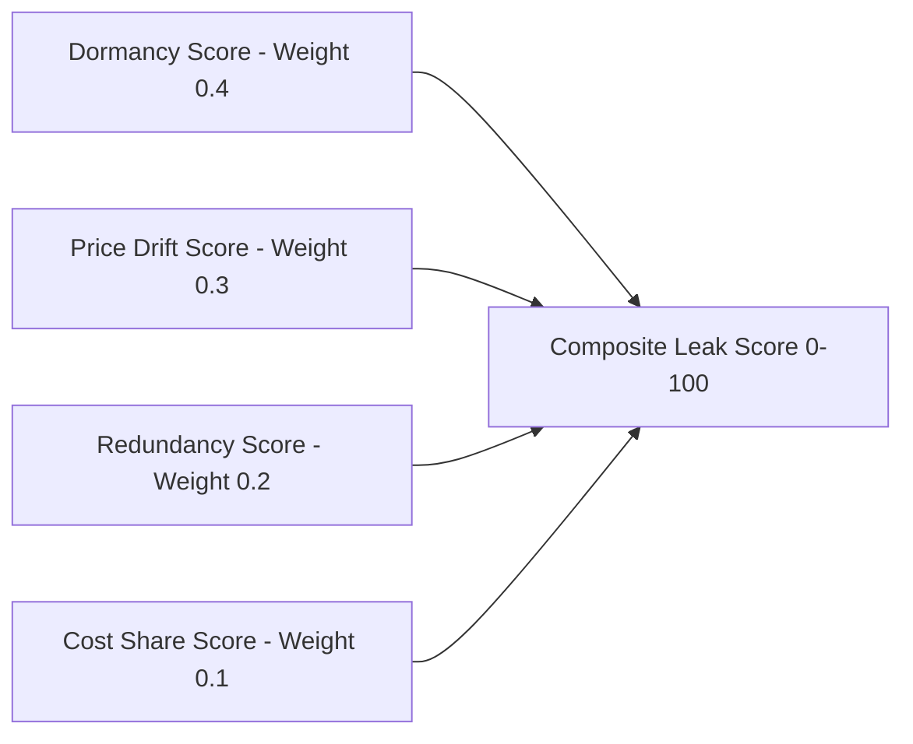

# ⚡ SubSense - Hidden Subscription & Recurring Payment Leak Detector

> **Hackathon Submission**: InnovaHack Chapter-1  
> **Domain**: FinTech  
> **Problem Statement 1**: Hidden Subscription & Recurring Payment Leak Detector  
> **Deployment Status**: Ready for 1-Click Vercel Deployment  

---

## 📌 Problem Statement & Real-World Pain Point

Millions of users in India and globally quietly lose thousands of rupees every month to recurring payment leaks. Subscriptions quietly auto-renew, services unannouncedly raise prices by 15–30%, unused/dormant memberships continue charging credit cards, and users subscribe to redundant services across identical categories (e.g. 3 streaming OTT apps or multiple AI tools).

Existing budget trackers fail because:
1. They require manual CSV categorization or paid bank scraping APIs.
2. They rely on simple merchant grouping (`upload CSV -> group by merchant -> show a table`), failing to distinguish one-off transactions from recurring interval billing.
3. They offer no actionable path to actually stop the leak beyond showing a number.

**SubSense** solves this by accepting raw bank SMS notifications or statements, parsing them through a two-tier extraction pipeline, running fuzzy merchant normalization & delta interval analysis, computing a transparent composite **Leak Score**, and dynamically drafting personalized cancellation/downgrade emails via Gemini AI.

---

## 🔥 Key Features

- **Synthetic Data Generator & Bundled Datasets**: Ships with a seedable TS generator simulating HDFC, SBI, ICICI, and Axis SMS notifications, planted with price hikes, dormant subscriptions, and distractor noise.
- **Two-Tier Extraction Pipeline**:
  - **Tier 1**: Deterministic Regex templates for Indian bank formats (`HDFC`, `SBI`, `ICICI`, `AXIS`).
  - **Tier 2**: `@google/genai` structured JSON fallback validated strictly with `Zod` schemas.
- **Fuzzy Merchant Normalization & Interval Detection**: Clusters merchant variants (e.g., `NETFLIX.COM`, `NETFLIX*ENTERTAINMENT`, `NETFLIX INDIA`) using Levenshtein distance & token overlap, computing charge interval consistency (weekly/monthly/quarterly/annual).
- **Price-Drift & Anomaly Engine**: Calculates standard deviation & Z-score across charge history to distinguish sustained step-change price hikes (`+25%`) from one-off spikes.
- **Composite Leak Score Formula**: Evaluates 4 weighted factors (Dormancy 40%, Price Drift 30%, Redundancy 20%, Cost Share 10%) with transparent UI breakdowns.
- **Gemini AI Action & Email Generator**: Generates ready-to-send personalized cancellation and downgrade emails live on demand.
- **What-If Savings Simulator**: Multi-select subscriptions to "cancel" and recalculate live projected monthly & annual savings.
- **100% In-Memory Privacy**: Zero persistent database storage required; session data is processed purely in-memory.

---

## ⚡ SubSense v2 Feature Expansions

1. **Grounded Gemini Chat Assistant (Tool Calling)**:
   - Live interactive assistant where users can ask natural language questions about their own computed leak report (e.g. *"Why is Netflix flagged?"*, *"Which subscription should I cancel first?"*, *"How much do I save if I cancel all high leak subs?"*).
   - Powered by Gemini function calling tool declarations (`getSubscriptionByName`, `getTopLeaksByScore`, `computeSavingsIfCancelled`, `getCategorySpendBreakdown`).
2. **12-Month Cumulative Waste Forecast**:
   - Forward extrapolation engine projecting price-drift trends forward over the next 12 billing cycles, rendered in a high-contrast Recharts AreaChart.
3. **Category Price Benchmarking**:
   - Compares detected subscriptions against typical Indian market category averages (`OTT`, `Food`, `SaaS`, `Fitness`, `Cloud`), flagging whether spend sits above, at, or below market baselines.
4. **Exportable PDF Executive Report**:
   - Instant 1-click client-side export generating a formatted executive PDF report summary for offline sharing or printing.

---

## 🏗️ System Architecture & Tool-Calling Flow



### Grounded Gemini Chat Assistant Tool-Calling Flow



---

## 🧮 Composite Leak Score Composition



### Formula
$$\text{LeakScore} = 0.4 \times \text{DormancyScore} + 0.3 \times \text{PriceDriftScore} + 0.2 \times \text{RedundancyScore} + 0.1 \times \text{CostShareScore}$$

- **DormancyScore (40%)**: 100 if subscription is flagged as dormant/unused; 0 if active.
- **PriceDriftScore (30%)**: 100 if sustained price hike detected with > 20% increase; 60 for spikes; 0 for stable.
- **RedundancyScore (20%)**: 100 if $\ge 3$ active subscriptions exist in the same category; 60 for 2; 0 if unique.
- **CostShareScore (10%)**: Monthly spend ratio relative to total recurring subscription outlay ($0 \text{--} 100$).

---

## 🛠️ Tech Stack Table

| Component | Technology / Library | Description |
| :--- | :--- | :--- |
| **Framework** | Next.js 14 (App Router) | React server/client framework |
| **Language** | TypeScript | Strict type safety across domain models |
| **Styling** | Tailwind CSS | Sleek, modern dark-themed UI components |
| **AI LLM** | Google Gemini API (`@google/genai`) | Tier 2 extraction & email draft generation |
| **Validation** | Zod | Strict schema validation of LLM outputs |
| **Fuzzy Matching** | `fastest-levenshtein` | Merchant string normalization & clustering |
| **Interval Math** | `date-fns` | Date delta & billing frequency calculation |
| **Data Viz** | Recharts | Donut breakdown & spend trend charts |
| **Testing** | Vitest | Automated unit test suite for core algorithms |

---

## 🚀 Quick Start & Setup Instructions

### Prerequisites
- Node.js `v18.0.0` or higher
- Free Google Gemini API Key from [Google AI Studio](https://aistudio.google.com/)

### 1. Clone & Install
```bash
git clone https://github.com/Destroyer795/subsense.git
cd subsense
npm install
```

### 2. Configure Environment Variables
Copy `.env.example` to `.env`:
```bash
cp .env.example .env
```
Fill in your Gemini API key in `.env`:
```env
GEMINI_API_KEY=your_gemini_api_key_here
GEMINI_MODEL=gemini-2.5-flash
```

### 3. Run Development Server
```bash
npm run dev
```
Open [http://localhost:3000](http://localhost:3000) in your browser.

### 4. Run Automated Unit Tests
```bash
npm test
```

---

## 📊 Regenerating Synthetic Datasets

To regenerate the bundled sample JSON datasets in `/data/samples/`:
```bash
npm run generate-data
```
Outputs:
- `data/samples/sample-standard.json` (90 txns)
- `data/samples/sample-tech-heavy-saas.json` (118 txns)
- `data/samples/sample-lifestyle-ott.json` (76 txns)

---

## 🌐 Deploying to Vercel

SubSense is stateless and ready for instant deployment to Vercel:

1. Push your repository to GitHub.
2. Import the project into Vercel.
3. Add the Environment Variable in Vercel settings:
   - `GEMINI_API_KEY`: Your Google AI Studio API key
   - `GEMINI_MODEL`: `gemini-2.5-flash`
4. Click **Deploy**.

---

## 📸 Screenshots

| Dashboard Overview | Subscription Details & AI Draft |
| :---: | :---: |
| `` | `` |

> *Note for judge review: Screenshots can be captured directly from the live running web UI.*

---

## 🔒 Known Limitations & Scope Transparency

- **Synthetic SMS Inputs**: The built-in generator creates synthetic Indian bank SMS formats (HDFC, SBI, ICICI, Axis). Real-world SMS logs may contain carrier-specific noise.
- **Dormancy Inputs**: Dormancy status is user-confirmed via a toggle in the UI or flagged via planted metadata, ensuring full transparency without invasive behavioral telemetry.
- **In-Memory Storage**: Financial data is never stored in a database, ensuring 100% privacy per session.

---

## 👥 Hackathon Team Information

- **Team Name**: SubSense Team
- **Track**: FinTech (Problem Statement 1)
- **Event**: InnovaHack Chapter-1
